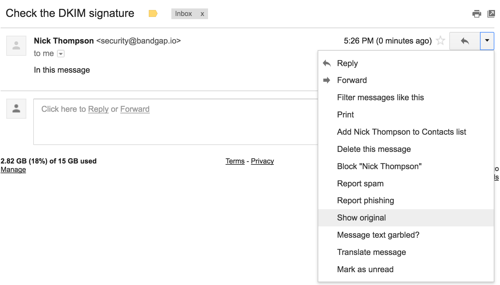
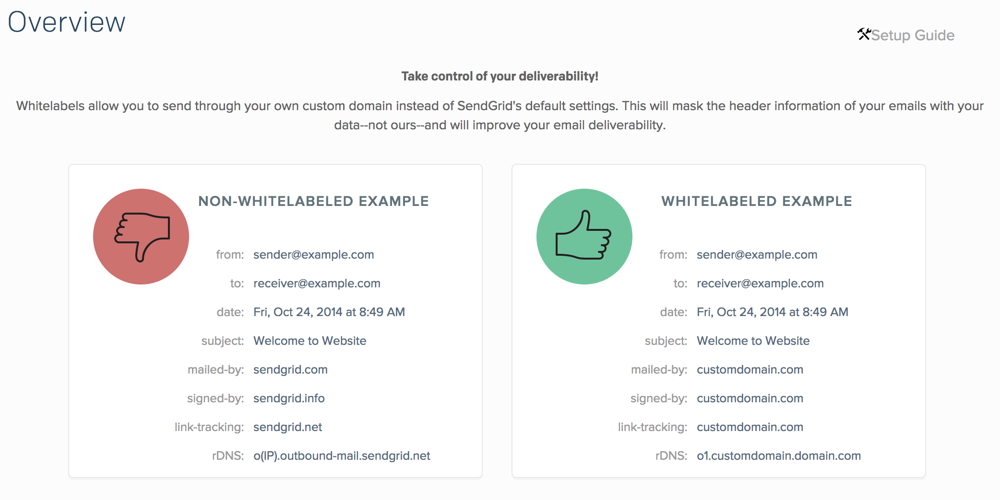

# Intro to Email

---

# Who this talk is for?

- People who want to send account activation and unsubscribe emails.

- People who want to make sure emails sent from their business's account are real.

- People who want to send marketing emails.

---

# Should I self-host my email?

Probably not.

You server's IP could be [blacklisted](http://mxtoolbox.com/SuperTool.aspx) because someone, somewhere used it for sending spam, then none of your emails will arrive.

You will receive tons of spam.

Plus, there are tons of free and 'freemium' emails servers out there, making it not worth the effort.

---

# Which email provider should I use for my business?

- Use an end-to-end encrypted/zero knowledge service.
I use [Protonmail](https://protonmail.com) which is incidentally [HIPAA compliant](https://protonmail.com/hippa-compliance).

- Any email provider which doesn't use end-to-end encryption will eventually get hacked. Note that [hushmail](https://hushmail.com) is not end-to-end encrypted.


---

# Personal preference, and used for this tutorial.

- We'll use protonmail for inbox/outbox management.

- We'll use [sendgrid](http://sendgrid.com/) for transactional email.

- Aside: I would rather use protonmail for both, but as of late 2016, protonmail has not implemented a transactional email service. They claim they have it on their roadmap.

- Aside: sendgrid is [not HIPAA compliant](https://sendgrid.com/docs/Classroom/Basics/Security/is_sendgrid_hipaa_compliant.html).

---

# Get protonmail to allow emails to be sent from your business's domain.

- Free emails from protonmail are always of the form `foo@protonmail.com`, but we want to send emails from `foo@my_business.com`.

- Custom domain support at protonmail costs $48/year, which is competitive.

---

# Domain verification

You must prove that you own a given domain before protonmail can send emails on its behalf.

1. protonmail sends a verification code to your protonmail account.

1. Then you prove that you control the account by putting the verification code in an `@TXT` record of your DNS.

---

# Domain verification


---

# Domain verification

Wait ~TTL, then validate the DNS record via

```bash
$ dig bandgap.io TXT +short
"protonmail-verification=6b34252054d7c60d3831e1b957c7561bb0d60adb"
```

---

Once we've proven that we control the domain, we want to be able to send and receive email.

---

#### What happens when we send an email to `bar@gmail.com`?

A DNS query to `gmail.com` asking for the `MX` record:

```bash
$ dig gmail.com MX +short
10 alt1.gmail-smtp-in.l.google.com.
20 alt2.gmail-smtp-in.l.google.com.
30 alt3.gmail-smtp-in.l.google.com.
40 alt4.gmail-smtp-in.l.google.com.
5 gmail-smtp-in.l.google.com.
```

It then attempts to deliver the mail to the mail exchanger with the *lowest* priority value, in this case `5 gmail-smtp-in.l.google.com`.

---

## We need an MX record to receive email:


---

## Validate correct setting of the MX record:

```bash
$ dig bandgap.io MX +short
10 mail.protonmail.ch.
```

---

## She deleted her MX record so Elvis wouldn't stalk her:


---

## Check [mail-tester.com](https://www.mail-tester.com/)

Once we have an MX record and a domain verification code, can we send email?

Yes, but it will end up in our users spam box.

To check the 'spammyness' of our emails, we will use [mail-tester.com](https://www.mail-tester.com).

---


---

We will discuss how to configure transactional email in django shortly, but for now, let's see what we can do with only a domain verification code and an MX record:

```python
>>> from django.core.mail import EmailMessage
>>> email = EmailMessage('hello',
                         'how ya doing?',
                         'foo@bandgap.io',
                         ['bar@protonmail.com'])
>>> # email.send() returns the number of successfully delivered emails:
>>> email.send()
1
```

This will go directly to the spam box.

---

## Spoofing emails is just too easy with this weak setup:

```python
>>> from django.core.mail import EmailMessage
>>> em = EmailMessage('hello',
                      'The file you requested is attached.',
                      'anyone@gmail.com',
                      ['anyoneelse@hotmail.com'])
>>> em.send()
1
```

---

## Defense as a user:

- There's almost no defense against email spoofing.

- When I spoofed an email from my wife to my own email, it didn't even get marked as spam.

- This is a little-known fact about STMP: It permits any computer to send email claiming to be from any source address.

---

## Defense as an email originator:

- Set the [SPF](https://en.wikipedia.org/wiki/Sender_Policy_Framework), [DKIM](https://en.wikipedia.org/wiki/DomainKeys_Identified_Mail), and [DMARK](https://en.wikipedia.org/wiki/DMARC) DNS entries.

---

## SPF: Sender Policy Framework

- SPF mitigates spoofing by allowing receiving mail exchangers to validate the originating IP address of an email.

- The SPF DNS entry is essentially a host whitelist.

---

## SPF Examples

```bash
$ dig gmail.com TXT +short
"v=spf1 redirect=_spf.google.com"
$ dig ycombinator.com TXT +short
"v=spf1 include:_spf.google.com include:mailgun.org include:_spf.createsend.com -all"
$ dig bandgap.io TXT +short
"v=spf1 include:_spf.protonmail.ch include:sendgrid.net mx ~all"
"protonmail-verification=6b34252054d7c60d3831e1b957c7561bb0d60adb"
```

---

## SPF Gotchas

An old RFC defined the `SPF` resource record.

This resource record has been deprecated, but some DNS providers still allow the field to be entered!

Don't use it, because recipients don't check it!

---

## SPF Syntax

The syntax is defined by [RFC 7208](https://tools.ietf.org/pdf/rfc7208.pdf), and an easier treatment is given at [openspf.org](http://www.openspf.org/SPF_Record_Syntax).

However, let's go through a couple of rules . . .

---

##  SPF Syntax

```bash
$ dig bandgap.io TXT +short
v=spf1 include:_spf.protonmail.ch mx ~all
```

The `all` *must* be the last token in the entry.

The `~all` specifies that hosts not matching the previous patterns should be 'softfailed'; marked as probably not legitimate.

---

## SPF Syntax

To mark emails originating from hosts not on your SPF entry as definitely not legitimate, use the hardfail `-all`:

```bash
$ dig bandgap.io TXT +short
v=spf1 include:_spf.protonmail.ch mx -all
```

---

To allow all hosts to send mail that another host allows, use the `include` section. For instance, since

```bash
$ dig _spf.protonmail.ch TXT +short
"v=spf1 ip4:37.35.106.36 ip4:37.35.106.40 ip4:185.70.40.0/24 ~all"
```

then

```bash
"v=spf1 include:_spf.protonmail.ch mx ~all"
```

is the same as

```bash
"v=spf1 ip4:37.35.106.36 ip4:37.35.106.40 ip4:185.70.40.0/24  mx ~all"
```

---

To allow your mail exchangers to send email from mail exchanger, add your `mx` record:

```bash
"v=spf1 mx ~all"
```

---

To allow any of `foo.com`'s IP addresses to send email on your behalf and softfail all other addresses, use

```bash
"v=spf1 a:foo.com ~all"
```

---

## Final SPF Record

Since we our using protonmail with sendgrid as the transactional email server, our SPF entry should look as follows:

```bash
$ dig bandgap.io TXT +short
"protonmail-verification=6b34252054d7c60d3831e1b957c7561bb0d60adb"
"v=spf1 mx include:_spf1.protonmail.com include:sendgrid.net ~all"
```


---

# When to hardfail vs softfail?

1. If we hardfail, then automated email forwarding will fail SPF validation.

1. If we softfail, then we might not be given any warning at all about SPF validation failure, especially if someone has found our contact list and spoofs a known contact.

---

## What does [mail-tester](mail-tester.com) think about us now?

---


---

## But we can do better by adding a digital signature to our message . . .


---

# Domain Key Identified Mail

DKIM is an email authentication method which attaches a digital signature to a sent email.

Recepients check the digital signature of a message in the DNS entry of the host.

---

# Validate the DKIM record:

```bash
$ dig TXT protonmail._domainkey.bandgap.io +short
"v=DKIM1\; k=rsa\; p=y9KdsGaxpKQPwR2Shcc..."
```


---

# The DKIM signature lives in the email header field

Normally, email providers do not show email headers to end users, but we can still take a look at them via 'Show Headers' in protonmail, or 'Show Original'  in gmail

---

# Get to email headers in gmail




---

# Interpreting the DKIM Signature

```bash
DKIM-Signature: v=1; a=rsa-sha256; c=relaxed/relaxed;
d=bandgap.io; s=protonmail; t=1477869966;
bh=PgKNtWhroRhalskdf8/s=;
h=Date:To:From:Reply-To:Subject:Feedback-ID:From;
b=GQFzSKPQWUEYft***
```

---

# Interpreting the DKIM Signature

- `a=rsa-sha256`: The signing algorithm
- `c=relaxed/relaxed`: The [canonicalization algorithm](http://dkim.org/specs/rfc4871-dkimbase.html#canonicalization), used to tolerate whitespace replacement and header field line rewrapping. Set to `c=simple/simple` to ensure no changes in transit.


---

# Interpreting the DKIM Signature

- `d=bandgap.io`: The domain that is queried for the public key.
- `s=protonmail`: The selector. Selectors are used to permit multiple keys under the same organization's domain name.

---

# Interpreting the DKIM Signature

- `t=1477869966`: Signature timestamp
- `bh=PgKNtWhroRhalskdf8/s=`: Body hash
- `h=Date:To:From:Reply-To:Subject:Feedback-ID:From`: List of header fields presented to the signing algorithm
- `b=GQFzSKPQWUEYft`: Body and header hash.

---

# DKIM Gotcha

The user does not sign the message, the mail exchanger signs it!

---

# DMARC

- The Domain-based Message Authentication, Reporting and Conformance (DMARC) header tells an receiving server what it should do if SPF and DKIM validation fails.

- In addition to SPF and DKIM checks, a DMARC enabled email must pass *alignment*: The FROM header of the email must match both the domain used to validate the SPF record and the `d=` section of the DKIM record.

---

# DMARC

A reasonable DMARC record is

```bash
"v=DMARC1; p=none; rua=mailto:address@yourdomain.com"
```

The `p=none` tells the receiving server to accept the email. Other options are `p=quarantine` (put in spam) and `p=reject`.

The `rua=mailto:` field tells the receiving server to notify you in the event of an email failing both SPF and DKIM checks.


---

# Validate the DMARC record:

```bash
$ dig _dmarc.bandgap.io TXT +short
"v=DMARC1\; p=none\; rua=mailto:security@bandgap.io\; ruf=mailto:security@bandgap.io\;"
```

---

# rua vs ruf DMARC records

If an `rua` field is specified in the DMARC record, then an aggregate report of DMARC failures is sent to the mailto link once a day.

If an `ruf` field is specified, a forensic report is sent immediately on DMARC failure.

---

Once we have an SPF, DKIM, and DMARC record, we can ask mail-tester.com what it thinks of our email:

---


---

## Transactional email

Thus far, we have only sent and received email from our protonmail.com dashboard.

We want to send *transactional emails*, which are sent based on a users interaction with a webapp.

---

## Transactional email providers

There a roughly a billion transactional email providers:

- sendgrid.com

- mailchimp.com

- mailjet.com

---

## Transactional email

We are using sendgrid.com in this tutorial; I chose it because it didn't ask me for credit card information to get the free tier of 12,000 emails/month.

The other services are probably fine.

---

## sendgrid.com: STMP vs Web API

Most transactional email providers allow both a web API and SMPT access.

We'll use the Web API, because of the following [annoying feature of gcloud](https://cloud.google.com/compute/docs/tutorials/sending-mail/):

> Google Compute Engine does not allow outbound connections on ports 25, 465, and 587.


---

## sendgrid API access

- Generate a sendgrid API key at [app.sendgrid.com/settings/api_keys](https://app.sendgrid.com/settings/api_keys)

---

## Install the sendgrid python package

```bash
$ pip3 install sendgrid
```

---

## Send an email to [mail-tester.com](https://www.mail-tester.com/) to test our tranactional spammyness

```python
>>> import sendgrid
>>> sg = sendgrid.SendGridAPIClient(apikey="MY_API_KEY")
>>> from sendgrid.helpers.mail import Email, Content, Mail
>>> from_email = Email("foo@bar.com")
>>> to_email = Email("web-x527Yv@mail-tester.com")
>>> content = Content("text/plain", "Hello, Email!")
>>> mail = Mail(from_email, "Hello!", to_email, content)
>>> response = sg.client.mail.send.post(request_body=mail.get())
>>> print(response.status_code)
202
```

---


---

## Our emails originating from sendgrid are way more spammy than our emails from the protonmail dashboard!

---

## Reducing our transactional spammyness

If we send ourselves an email and checkout the headers, we see that we have a dmarc failure:

```bash
Authentication-Results:
    dmarc=fail (p=NONE dis=NONE) header.from=bandgap.io
```

We have failed the dmarc alignment check, as the DKIM signature is from `d=sendgrid.net`, and not `d=bandgap.io`.


---

## DMARC Alignment in Sendgrid

- DMARC alignment is sendgrid is achieved via 'whitelabels'

---

## Sendgrid whitelisting



---

## Sendgrid whitelisting

- To whitelist in sendgrid, you need to add some CNAME records to your DNS, essentially giving your permission to a redirect:

```bash
$ dig mail.bandgap.io CNAME +short
u38641375.wl226.sendgrid.net.
```

---

## Transactional Email: Final thoughts

These are simply first steps you must take to keep your transactional emails out of the spam box.

If you spam people, your reputation will drop dramatically and you'll wind up in the spam box no matter how authenticated you are.
