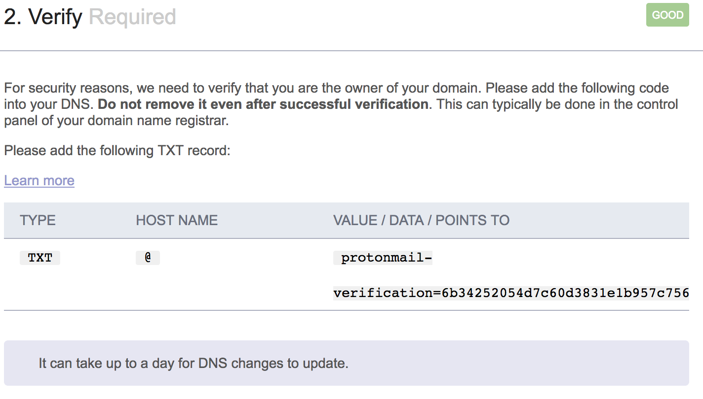
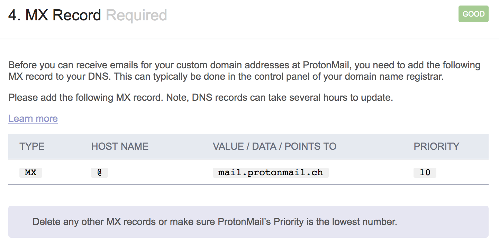

# Intro to Email

---

# Who this talk is for?

- People who want to send account activation and unsubscribe emails.

- People who want to make sure emails sent from their business's account are real.

- People who want to send marketing emails.

---

# Should I self-host my email?

Probably not.

You server's IP could be [blacklisted](http://mxtoolbox.com/SuperTool.aspx) because someone, somewhere used it for sending spam, then none of your emails will arrive.

You will receive tons of spam.

Plus, there are tons of free and 'freemium' emails servers out there, making it not worth the effort.

---

# Which email provider should I use for my business?

- Use an end-to-end encrypted service. I use [Protonmail](https://protonmail.com) which is incidentally [HIPPA compliant](https://protonmail.com/hippa-compliance).

- Any email provider which doesn't use end-to-end encryption will eventually get hacked. Note that [hushmail](https://hushmail.com) is not end-to-end encrypted.


---

# Personal preference, and used for this tutorial.

- We'll use protonmail for inbox/outbox management.

- We'll use [sendgrid](http://sendgrid.com/) for transactional email.

- Aside: I would rather use protonmail for both, but as of late 2016, protonmail has not implemented a transactional email service. They claim they have it on their feature list.

- Aside: sendgrid is [not HIPPA compliant](https://sendgrid.com/docs/Classroom/Basics/Security/is_sendgrid_hipaa_compliant.html).

---

# Get protonmail to allow emails to be sent from your business's domain.

- Free emails from protonmail are always of the form `foo@protonmail.com`, but we want to send emails from `foo@my_business.com`.

- Custom domain support at protonmail costs $48/year, which is competitive.

---

# Domain verification

You must prove that you own a given domain before protonmail can send emails on its behalf.

1. protonmail sends a verification code to your protonmail account.

1. Then you prove that you control the account by putting the verification code in an `@TXT` record of your DNS.

---



---

# Domain verification

Wait ~TTL, then validate the DNS record via

```bash
$ dig bandgap.io TXT +short
"protonmail-verification=6b34252054d7c60d3831e1b957c7561bb0d60adb"
```

---

Once we've proven that we control the domain, we want to be able to send and receive email.

---

#### What happens when we send an email to `bar@gmail.com`?

A DNS query to `gmail.com` asking for the `MX` record:

```bash
$ dig gmail.com MX +short
10 alt1.gmail-smtp-in.l.google.com.
20 alt2.gmail-smtp-in.l.google.com.
30 alt3.gmail-smtp-in.l.google.com.
40 alt4.gmail-smtp-in.l.google.com.
5 gmail-smtp-in.l.google.com.
```

It then attempts to deliver the mail to the mail exchanger with the *lowest* priority value, in this case `5 gmail-smtp-in.l.google.com`.

---

## We need an MX record to receive email:



---

## Validate correct setting of the MX record:

```bash
$ dig bandgap.io MX +short
10 mail.protonmail.ch.
```

---

## She deleted her MX record so Elvis wouldn't stalk her:


---

## Let's see what [mail-tester.com](https://www.mail-tester.com/) thinks of our email:

---


---

We will discuss how to configure email in django shortly, but for now, let's see what we can do:

```python
>>> from django.core.mail import EmailMessage
>>> email = EmailMessage('hello',
                         'how ya doing?',
                         'foo@bandgap.io',
                         ['bar@protonmail.com'])
>>> email.send()
1
```

This will go directly to the spam box.

---

## Spoofing emails is just too easy:

```python
>>> from django.core.mail import EmailMessage
>>> em = EmailMessage('hello',
                      'The file you requested is attached.',
                      'anyone@gmail.com',
                      ['anyoneelse@hotmail.com'])
>>> em.send()
1
```

---

## Defense as a user:

- There's almost no defense against email spoofing.

- When I spoofed an email from my wife to my own email, it didn't even get marked as spam.

- This is a little-known fact about STMP: It permits any computer to send email claiming to be from any source address.

---

## Defense as an email originator:

- Set the [SPF](https://en.wikipedia.org/wiki/Sender_Policy_Framework), [DKIM](https://en.wikipedia.org/wiki/DomainKeys_Identified_Mail), and [DMARK](https://en.wikipedia.org/wiki/DMARC) DNS entries.

---

## SPF: Sender Policy Framework

- SPF mitigates spoofing by allowing receiving mail exchangers to validate the originating IP address of an email.

- The SPF DNS entry is essentially a whitelist of hosts.

---

## SPF Examples

```bash
$ dig gmail.com TXT +short
"v=spf1 redirect=_spf.google.com"
$ dig ycombinator.com TXT +short
"v=spf1 include:_spf.google.com include:mailgun.org include:_spf.createsend.com -all"
```

---

## SPF Gotchas

An old RFC defined the `SPF` resource record.

This resource record has been deprecated, but some DNS providers still allow the field to be entered!

Don't use it!

---

## SPF Syntax

The syntax is defined by [RFC 7208](https://tools.ietf.org/pdf/rfc7208.pdf), and of course it is painful.

However, let's go through a couple of rules . . .

---

##  SPF Syntax

```bash
$ dig bandgap.io TXT +short
v=spf1 include:_spf.protonmail.ch mx ~all
```

The `all` *must* be the last token in the entry.

The `~all` specifies that hosts not matching the previous patterns should be 'softfailed'; marked as probably not legitimate.

---

## SPF Syntax

To mark emails originating from hosts not on your SPF entry as definitely not legitimate, use the hardfail `-all`:

```bash
$ dig bandgap.io TXT +short
v=spf1 include:_spf.protonmail.ch mx -all
```

---

To allow all hosts to send mail that another host allows, use the `include` section. For instance, since

```bash
$ dig _spf.protonmail.ch TXT +short
"v=spf1 ip4:37.35.106.36 ip4:37.35.106.40 ip4:185.70.40.0/24 ~all"
```

then

```bash
"v=spf1 include:_spf.protonmail.ch mx ~all"
```

is the same as

```bash
"v=spf1 ip4:37.35.106.36 ip4:37.35.106.40 ip4:185.70.40.0/24  mx ~all"
```

---

To allow your mail exchangers to send email from your domain, whitelist the your `mx` record:

```bash
"v=spf1 mx ~all"
```

---

To allow any of `foo.com`'s IP addresses to send email on your behalf and softfail all other addresses, use

```bash
"v=spf1 a:foo.com ~all"
```

---

## Final SPF Record

Since we our using protonmail with sendgrid as the transactional email server, our SPF entry should look as follows:

```bash
$ dig bandgap.io TXT +short
"protonmail-verification=6b34252054d7c60d3831e1b957c7561bb0d60adb"
"v=spf1 mx include:_spf1.protonmail.com include:sendgrid.net ~all"
```


---

## What does [mail-tester](mail-tester.com) think about us now?

---


---

## But we can do better . . . 


---

Once we have an SPF, DKIM, and DMARC record, we can ask mail-tester.com what it thinks of our email:


---


---
